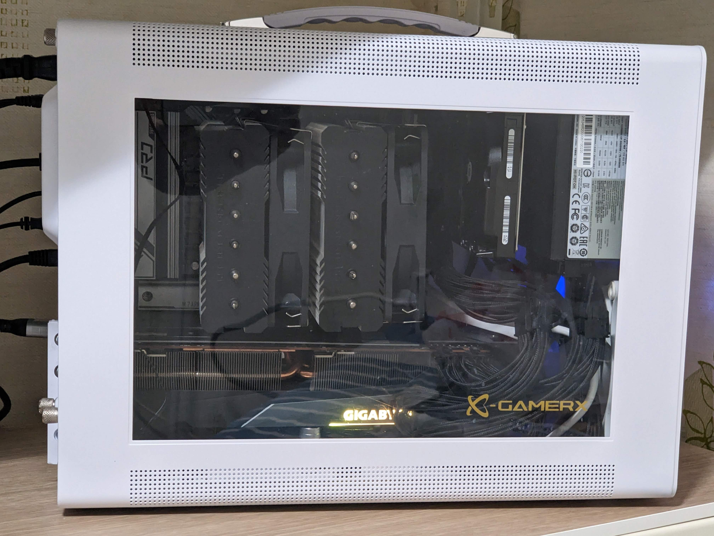

  

7800x3D  
ASROCK B650M PRO RS  
기가바이트 6800XT  
SF750 SFX 파워  
쿨러 PA120 SE  
3.5 HDD 1개 (파워 옆)  
2.5 SSD 1개 (케이스 바닥)

20L 정도의 케이스는 상대적으로 수요가 별로 없는 편인데, 아마도 하드웨어 커뮤니티에서 케이스가 작으면 쿨링이 안된다는 말을 너무 많이 봐서일 것입니다.  
하지만 직접 써본 사람들은 알지요.  
케이스가 작아도, 메쉬이든 아니든, 쿨링은 크게 문제가 안된다는 것을.  
이런 케이스들이 문제되면 SFF 케이스는 어떻게 쓰겠습니까...   
보드에서 커옵 -20, 온도제한 75도 정도 걸고, 저소음 세팅하면 심리적으로도 안정되고 성능 손해도 사실상 거의 없습니다.  

암튼 M-CUBE 사용중에 파워트레인 P60 케이스를 알게 되었고, 사용하던 부품 그대로 옮겨보았습니다.  

결론은 `아주 추천할만한 케이스`이고 아래는 느낀 점들입니다.  

- 디자인은 호불호가 있겠지만, P60이 더 고급스러워 보입니다.  
- 조립할 때 M-CUBE 보다는 더 번거롭고 손이 많이 갑니다.  
  특히 상단쪽이 번거로운데, 긴 드라이버가 없다면 좀 곤란할 수 있습니다.  
  대신 파워 뒤쪽에 여유 공간이 많아서 조립 마지막에 케이블 막 밀어넣기 좋습니다.  
- 3슬롯 이상 두꺼운 그래픽카드를 장착하면, 하단팬을 달 수는 있겠지만 그래픽카드와의 간격이 너무 좁아집니다.  
  이 말은 하단에 3.5 HDD 를 장착하기 어렵다는 말과도 같습니다. 당연히 불가능은 아닙니다.  
  사실 하단팬은 쿨링에 별 도움이 안되므로 미련을 버립시다.  
- SFX 파워를 사용할 경우 파워 브라켓쪽에 남는 구멍이 있어서 거기에 3.5 HDD 혹은 SSD를 더 달면 됩니다.  
  다만 정식 위치는 아니기 때문에 나사 구멍이 딱 맞게 가공되어 있지는 않지만, 장착할 수 있습니다.
- M-CUBE와 비교할 때 쿨링은 비슷하거나 더 좋습니다.  
  (M-CUBE 때와 팬소리가 비슷하게 들리도록 설정했습니다)