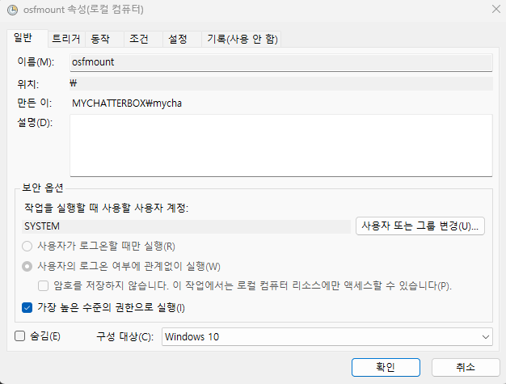
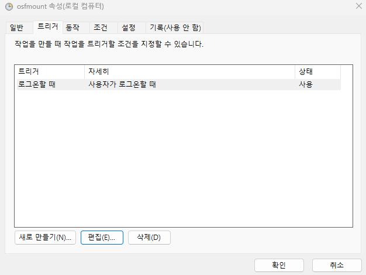
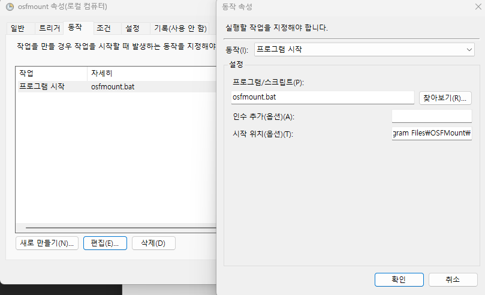

램이 아주 여유롭지 않으면 dynamic 방식이 가능한 [Imdisk](https://sourceforge.net/projects/imdisk-toolkit/) 램디스크가 더 편리하고 간편하지만 개인적인 이유로 OSFMOUNT 로 변경했습니다.  
간단하게 사용할 경우 Imdisk 가 훨씬 좋은 선택일 수 있습니다.  
OSFMOUNT는 항상 고정된 크기로만 사용할 수 있습니다.  

윈도우 시작 시 자동으로 OSFMOUNT 램디스크를 생성하고 몇 개의 폴더를 만드는 방법을 설명합니다.

1. [OSFMOUNT](https://www.osforensics.com/tools/mount-disk-images.html) 설치
2. OSFMount 폴더 혹은 임의의 위치에 osfmount.bat 와 같은 빈 파일을 만듭니다.  
   다른 위치에 만들 경우 작업 스케줄러의 동작탭에서 위치를 수정합니다.
3. osfmount.bat 파일을 메모장 등 에디터로 열고 아래 내용으로 저장합니다.  
   아래 예시는 드라이브명은 `R 드라이브, 이름 RAMDISK, 16기가 용량`으로 설정합니다. 환경에 맞게 적절히 수정합니다.

   ```
   @echo off
   osfmount -a -t vm -o rw,hd,format:ntfs:"RAMDISK" -m R: -s 16G
   ```

4. 미리 폴더를 만들고 싶다면 아래 코드를 적절하게 수정 후 추가하고 저장합니다.

   ```
   timeout  /t 3
   mkdir r:\Chrome\Cache
   mkdir r:\Chromium\Cache
   mkdir r:\Temp
   ```

5. 이제 osfmount.bat 파일을 작업 스케줄러에 아래와 같이 혹은 각자의 방법으로 등록합니다.  
   왠지 작동이 안되는 것 같으면 작업 스케줄러의 계정 부분이나 동작 탭의 설정 부분을 잘 확인합니다.

`주의`  
윈도우 시작 시 바탕화면에 진입한 후 너무 빨리 이런저런(크롬을 실행한다거나) 작업을 하려고 하면 램디스크가 만들어지지 않는 경우가 생길 수 있습니다.  
당황하지 말고 osfmount.bat 파일을 수동으로 실행합니다.  





