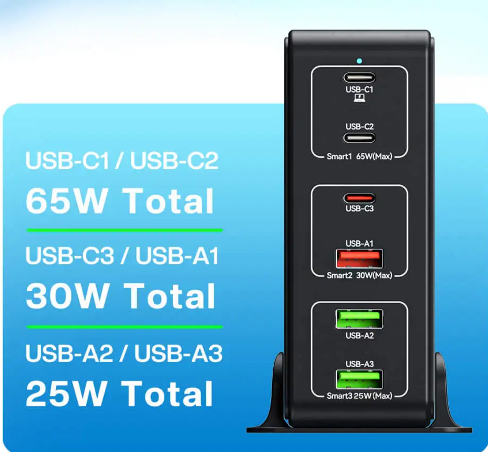
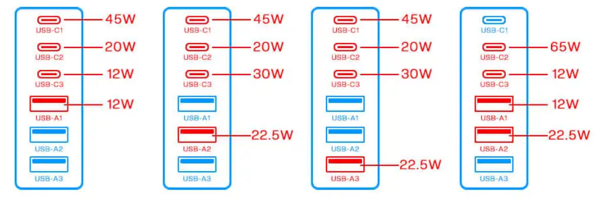
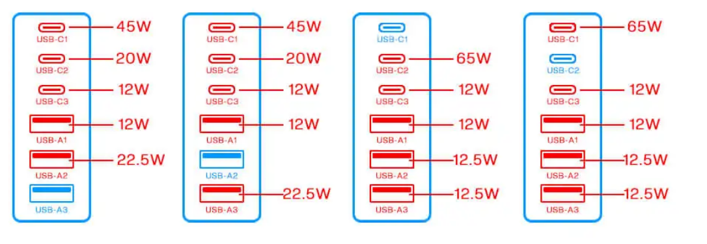
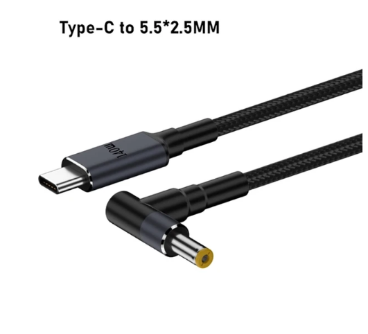
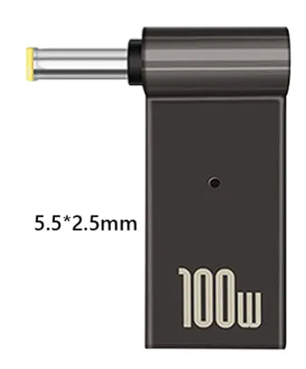

알리에서 흔히 볼 수 있는 여러 충전기들 중 하나입니다. 약 2만원.  
65W + 30W + 25W 라서 120W 충전기로 표기합니다.

포트 개수가 많은 충전기들은 대부분 위처럼 어떤 특정한 규칙이 있고, 판매 페이지에 표기하고 있습니다.  
흔히 말하는 고정출력, 가변출력을 확인하기 위함인데요.  
일단 위 설명대로는 6포트 모두 가변출력입니다.

위의 충전기는 전면 디자인에 2칸씩 묶은 테두리를 그려서 다른 충전기들보다는 조금 더 명확하게 보여주고 있는데
설명하자면 C1, C2 포트는 각각 혼자 쓰면 65W 출력 가능하지만 동시에 사용하면 45W + 20W 출력으로 변경됩니다.
C3, C4 포트도 마찬가지로 각각 혼자 쓰면 30W 이지만 동시에 사용할 경우 12W + 12W 출력으로 변경됩니다.

N100 CPU를 사용하는 미니PC는 보통 소비전력이 30W 이하라서, C3 포트에 연결해도 되겠지만 혹시 모르니 65W를 지원하는 C1 포트에 사용합니다.  
이때 `가변출력`을 생각해야 합니다.

C1 포트에 연결해서 65W 출력으로 여유롭게 사용하다가, `C2 포트에 케이블 연결해서 휴대폰 충전하는 순간` C1, C2 포트가 일시 리셋(OFF)되고 잠시 후 45W + 20W 출력으로 변하게 됩니다. 이 과정에서 `PC가 꺼집니다.`
휴대폰이나 노트북, 패드는 내장 배터리가 있어서 아무 상관이 없지만 PC 는 한 번 꺼지면 끝이므로 문제가 됩니다.

>#### 이것을 해결하는 방법은 아주 간단한데, C2포트를 사용하지 않으면 됩니다.
>
>#### 이게 무슨 개소리야? 6포트 짜리 샀는데 하나를 안 쓴다고?
>
>#### 네.

애초에 이 충전기를 65W 고정출력을 가진 5포트 충전기라고 생각하면 됩니다.  
만약 C4 포트도 사용하지 않으면
결국 이 충전기는 65W, 30W 고정출력 포트 2개, 가변출력 포트 2개를 가진 4포트 충전기가 됩니다.  

`아트뮤 등 국내브랜드꺼는 고정출력이라서 좋다고 하던데요?`  
고정출력 포트의 출력과, 포트수를 확인하시고 마지막으로 가격을 확인해보세요.  
2만원으로는 불가능하고 나온다면 7-8만원 정도 예상됩니다.

또 필요한 것은 미니PC의 DC 충전 구멍 사이즈를 확인해서 아래와 같은 변환 케이블 혹은 젠더를 구매해야 합니다.  
Beelink 제품은 5.5mm x 2.5mm 입니다.  
검색을 해보면 5.5mm 는 공통이고 2.5mm 인지 2.1mm 인지가 명확하지 않은데, 2.5mm 와 2.1mm 는 호환이 되기도 하고 안되기도 하는 것 같습니다.

