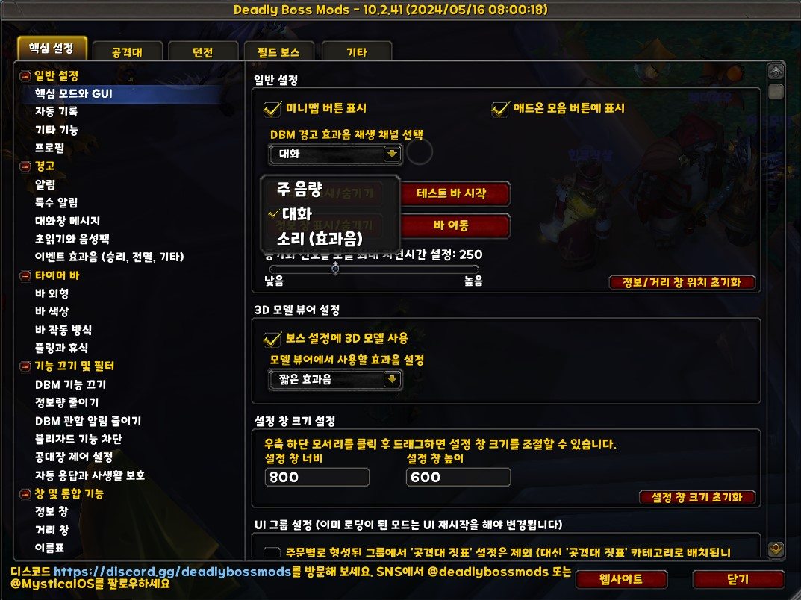
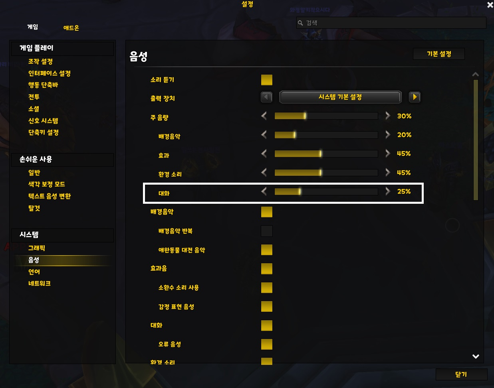

/dbm 으로 옵션창을 열고 `일반 설정-핵심 모드와 GUI`  탭을 들어가면 아래 스크린샷처럼 `DBM 경고 효과음 재생 채널 선택` 이라는 옵션이 있습니다.  
아래 스크린샷을 참고하셔서 각자 설정에 맞게 소리 크기를 설정하세요.  
와우에서는 내장된 기본 대화 시스템을 거의 사용하지 않으므로 대화 채널을 추천합니다만, 와우 기본 대화 사용하시는 분들은 다른 채널로 설정하세요. 

