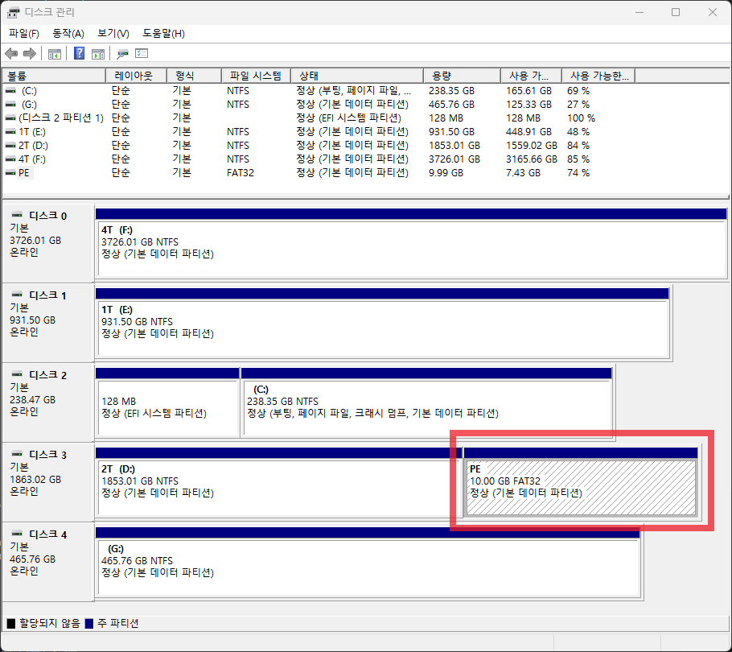
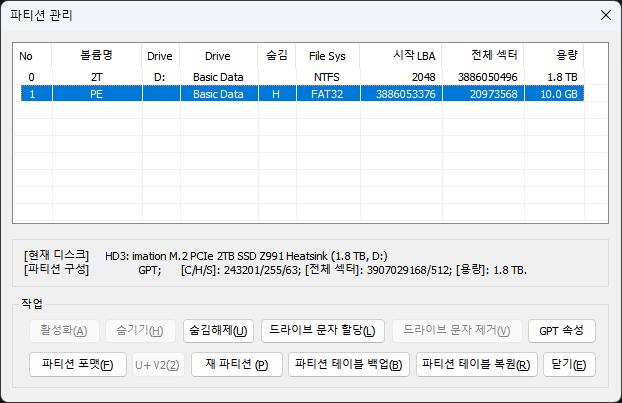
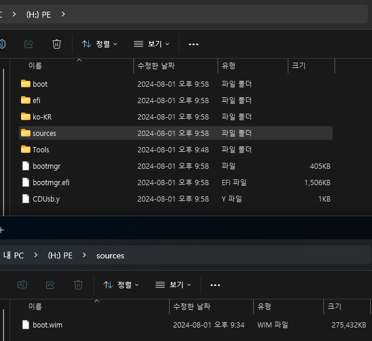
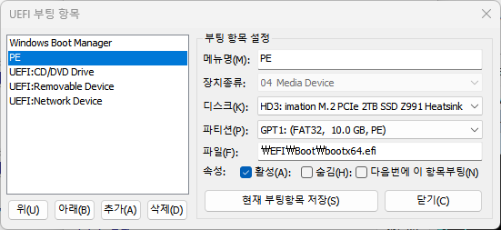

무언가 잘 되지 않아서 이 글까지 흘러 들어오셨을테고, 어느 정도의 기본 지식과 경험은 있을거라 생각합니다.  
일반적인 멀티부팅 메뉴에 추가해도 되겠지만, UEFI 메뉴에 추가하면 매번 멀티부팅 메뉴를 보지 않아도 돼서 더 깔끔하겠지요.  

바로 내용으로 들어갑시다.  
2TB SSD를 D로 사용하고, 볼륨을 10기가 축소한 뒤, 10GB 짜리 FAT32인 H 파티션을 만들고 그 안에 PE와 프로그램들을 넣어둔 상태입니다.  
본인의 상황에 맞게 드라이브, 용량을 다르게 설정해도 됩니다.  

일단 순서대로 캡쳐부터 확인합시다.  
아래에서 다시 정리하겠습니다.

차근차근 확인합니다.  
1. PE 를 설치할 드라이브 선택하고 몇 GB 정도 볼륨축소해서 PE 설치할 파티션을 하나 만듭니다.  
볼륨축소해도 기존 데이터는 지워지지 않습니다.  
새로 만든 파티션을 FAT32 로 포맷합니다.  
2. BOOTICE - 디스크 - 대상 디스크에서 해당 디스크를 선택한 뒤 파티션관리 메뉴를 클릭합니다.  
PE를 설치할 파티션을 선택한 뒤 `GPT 속성`을 클릭합니다.
3. 이제 해당 파티션에 필요한 폴더/파일들을 복사합니다.  
ISO 파일로 만들어진 PE에서 추출하는 것을 추천합니다.  
sources 폴더에 boot.wim 파일이 있는지 확인합니다.  
파일명이 다르면 boot.wim 으로 변경하고, 다른 PE(wim) 를 복사해서 boot.wim 으로 변경해도 됩니다.  
4. BOOTICE - UEFI 부팅 항목 편집에서 PE 항목을 생성하고 편집합니다.  
5. 재부팅 한 뒤 제조사별로 정해진 UEFI 단축키로 PE 메뉴가 뜨는지 확인합니다.  
ASROCK 보드일 경우 F11 키입니다.
6. 오류가 난다면 처음부터 `꼼꼼하게` 다시 확인합니다.  
특히 UEFI 항목, 경로/오타를 잘 확인해야 합니다.
이 글은 UEFI 메뉴에 등록하는 것이므로 BCD와는 상관없습니다.