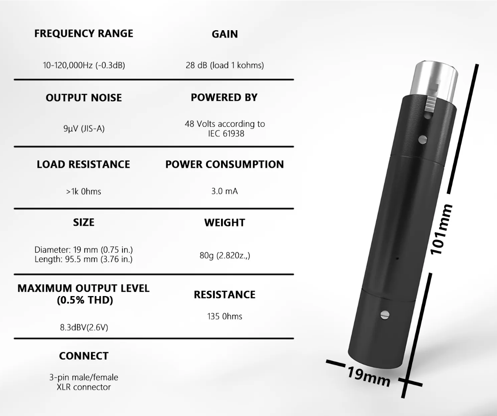
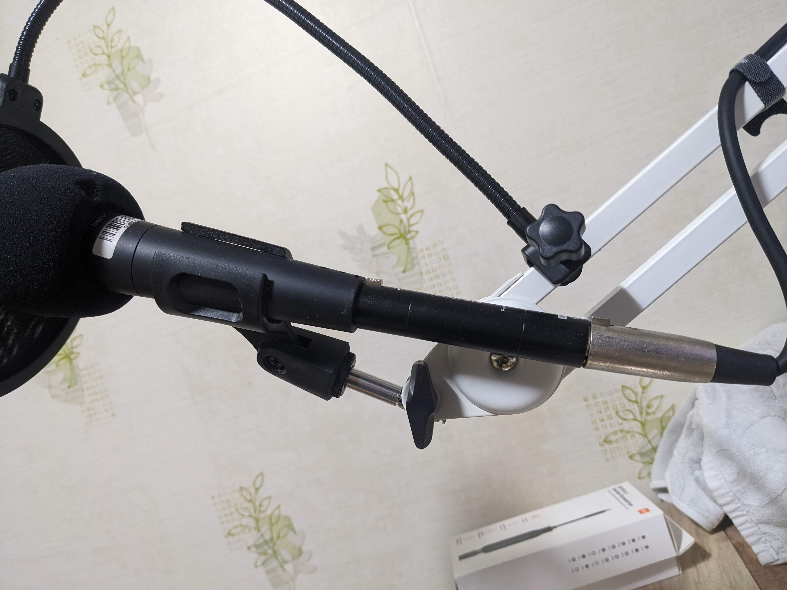

디스코드 등 타인과의 대화를 위해 마이크를 사야 한다면 개인적으로는 무조건 다이나믹마이크를 추천합니다.

아무리 비싸더라도 콘덴서 마이크를 사용한다면 내 키보드 소리를 포함해서 모든 사소한 소리가 세세하게 마이크로 들어가기 때문에 디스코드 등 프로그램 혹은 사운드 설정을 정말 세밀하게 설정하지 않는 이상 상대방은 고통받게 됩니다. 만약 설정을 잘했다면 내 목소리의 음질은 구매한 마이크 값어치를 못할 수준으로 떨어졌을테니 돈 들인 보람이 없겠지요.

다이나믹마이크의 유일한 단점은 내 목소리의 크기가 작아서 크게 말해야 하거나, 마이크를 입에서 멀리 두기 어렵다는 것인데 오디오 인터페이스를 사용할 경우 아래 증폭 앰프로 이런 단점을 상당히 보완할 수 있습니다. 다이나믹마이크 사용할 때는 필요하지 않았던 오인페의 48V 팬텀파워를 사용합니다.

국내에서 판매되는 비슷한 제품들도 많지만,
비슷하게 생긴 제품들의 스펙이 전부 28dB 볼륨 게인인 것을 보면, 개인적으로 생각하기에는 성능은 동일할 것 같습니다.  
알리에서 구매하면 만원 초반인 반면 국내가는...  
검색어는 GAZ-MA1 혹은 dynamic mic amplifier 혹은 한글로 다이나믹마이크 앰프 정도로 검색해도 확인할 수 있습니다.

