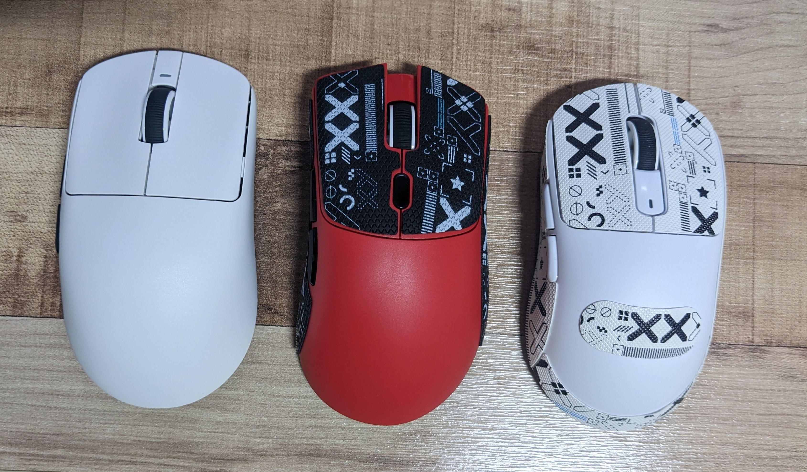

원래 사용중인 G304 마우스가 너무 무겁게 느껴져서 비슷한 스펙의 마우스 3가지를 한꺼번에 구매해서 비교해보았습니다.  
세 마우스 모두 C 충전구멍에 원형 마그네틱 커넥터가 들어가지 않는 것은 참 안타깝습니다.  
납작한 커넥터는 들어갑니다.  

`VXE R1 SE+` 왼쪽 화이트 19,699원  
PAW3395SE 센서, 51g, 배터리 500mAh  

배터리 용량이 큰데도 무겁지 않습니다.  
표면은 확실히 덜 미끄러워서 그립패치를 붙이지 않아도 될 것 같습니다. 그래서 제공하지 않는 것인지도.  

좌클릭/우클릭 클릭압은 셋 다 비슷하고, 클릭 소리는 셋 중에서 보통인데, 왼쪽 사이드 버튼 키감과 소리는 정말 별로입니다.  

더 큰 문제는 휠키 입니다.  
휠 클릭이 정말 힘듭니다. 다른 마우스보다 훨씬 강한 힘으로 눌러야 하고, 스크롤도 뻑뻑합니다.  

C 충전구멍이 너무 좁습니다.  
기본제공 케이블 외에 다른 C타입 케이블이 구멍에 들어가질 않습니다.  이 무슨 애플스런 제품인지...  
압도적 비추.

  

`Attack Shark X3` 오른쪽 화이트 24,596원  
PAW3395 센서, 49g, 배터리 미표기?  

잠자리 R1 SE 를 좌우 약간 더 슬림하게 만든 형태라고 생각하면 될 것 같습니다.  
센서 스펙은 제일 좋은데 배터리 용량 표기가 없네요.  약 300 정도이지 않을까 싶습니다.  

셋 중에서 클릭압, 클릭소리는 제일 조용하고 좋습니다.  

누군가는 그 돈이면 조금 더 보태서 VXE R1 PRO MAX 를 살 수 있다고 하겠지만 티몬이 이 지경인데 과연 그런 딜이 쉽게 다시 올런지...

  

`Attack Shark R1` 가운데 빨강, 10,660원  
PAW3311 센서, 59g, 배터리 300mAh  

데스에더 마우스를 조금 작게 만든 형태입니다.  
표면이 미끄러운데, 제공하는 그립패치가 좋네요. X3랑 같은 브랜드이고 그립패치의 디자인이 동일한데 이상하게 검은색 패치의 미끌림이 훨씬 적습니다.  

다른 두 마우스와 달리 비대칭형이라 오른손으로 잡으면 확실히 그립감이 좋습니다.  

좌클릭/우클릭 소리가 상대적으로 조금 더 크지만, 보통 마우스 수준입니다. 사이드 버튼은 아주 조용하고 쉽게 눌립니다.  

이 마우스를 센서때문에 비추한다는 것은 이 금액에 깔 것이 거의 없기 때문입니다.  

그동안 집과 사무실에서 로지텍 G304 를 써왔는데  
가격, 성능, 무게 등등 무엇으로 비교해봐도 Attack Shark R1 이 훨씬 나은 선택인 것 같습니다.  
하지만 아직 똥을 찍어 먹어보지 못한 당신은 잠자리 마우스가 훨씬 유명한데 그래도 이유가 있으니까 많은 사람들이 R1 SE+ 추천하는 것이 아닐까? 하는 생각을 여전히 떨치기 어려울 것입니다.  
