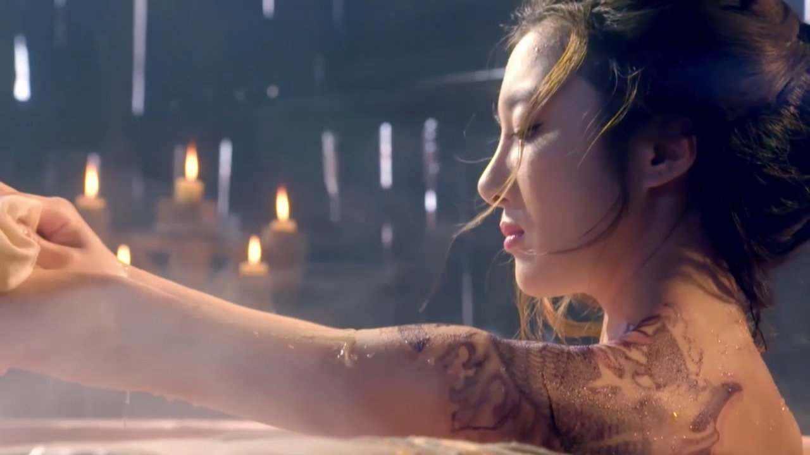

`원작 소설의 내용을 많이 노출하고 있습니다.`

국내에는 2016년도에 방영했으나 중국에서는 2015년도로 확인되니 신소십일랑 2015 으로 불러야 할까요.

드라마 신소십일랑은 고룡의 소설 소십일랑(簫十一郞)(1부격)과 후속 화병소십일랑(火幷蕭十一郎)(2부격)을 묶어서 드라마화했습니다.

소십일랑은 고룡 소설 중에서 상대적으로 인기가 좋지는 않습니다.  
고룡의 다른 주인공들에 비해 주인공 소십일랑의 개성이 약하고, 무협지라기보다는 사랑이야기의 느낌이 강합니다.  
사랑이야기라고 해서 곽정과 황용같은 알콩달콩하고 풋풋한 느낌은 또 아니지요. 

드라마 신소십일랑 2015는 소설과 전체적인 줄거리는 비슷한 편이지만 원래는 없었거나 역할이 대폭 바뀐 배역이 많습니다.

결론부터 말하면 무협드라마 좋아하는 사람이라면 볼만할 수도 있겠지만 고룡의 팬으로써는 좋은 점수를 못 주겠네요.

배역과 함께 소설과의 차이점을 살펴봅니다.

소설 소십일랑, 화병소십일랑은 특이하게 풍사랑의 목욕 장면으로 시작하는데, 드라마도 역시 풍사랑의 목욕 장면으로 시작합니다.

풍사랑을 먼저 소개하는 이유는 사실 소설의 진정한 주인공은 풍사랑이기 때문입니다. 다시 말하지만 이 소설은 무협이라기 보다는 사랑이야기에 가깝습니다.

드라마에서는 풍사랑의 역할을 많이 축소해서 소십일랑 옆에서 사고나 치고 다니고 심벽군을 질투하지만 끝내 양개태하고 이어지는, 전형적인 조연 캐릭터에 가깝게 묘사했으나 소설 속의 풍사랑은 드라마에서보다 훨씬 매력적입니다. 

소십일랑을 향한 마음이 일부 표정연기에서 조금 나타날 뿐, 풍사랑이 제대로 표현되지 않았습니다.
이건 배우의 문제가 아니라 심벽군에게 포커스를 맞추느라 그런 것 같습니다.

재미있는 점은 소설이나 드라마에서 유독 풍사랑만 나이를 알려줍니다.  
드라마에서는 30세이지만, 소설 소십일랑에서 34세, 화병소십일랑에서 36세로 나오는데 소설 속 묘사로는 나이티가 나지 않고, 아주 미인입니다.  
19세때 약 15세 정도로 추측되는 소십일랑을 만나 15년 이상을 알고 지내는 사이인데, 무공은 강하지 않지만 말빨이 쎄고 잔머리가 좋아서 '여요괴'로 불립니다.  
험난한 강호에서 여자 혼자 굴러먹으려면 풍사랑 정도는 되어야 합니다.  
캐스팅은 훌륭합니다.

대부분의 고룡 소설이 그렇듯이, 소설 소십일랑은 전체적인 분위기가 상당히 어두운데 드라마는 조금 더 밝게 설정했습니다.  
주인공인데 별로 할 말이 없네요. 다시 말하지만 이 작품의 진짜 주인공은 풍사랑이라서 그렇습니다.  
배우 캐스팅과 연기는 괜찮았습니다.

제 눈에는 배역과 별로 어울리지 않았고, 연기도 그저 그렇던데 본토 반응이 궁금합니다.

드라마에서는 연성벽과 합방을 하기 전에 헤어지므로 소십일랑과 이어지는 것에 대한 거부감이 덜할 수 있겠으나 
소설에서는 이미 연성벽의 정식 부인이며 임신 상태인데  소십일랑의 관계때문에 개고생해서 유산까지 합니다.

소설에서는 마냥 온실속의 회초처럼 곱게 자란 심벽군이 마침내 독립해서 혼자 살아갈 수 있을 만큼 성장하는 것을 보여주지만 드라마에서는 제대로 표현하지 못했습니다.

드라마와 달리 소설에서는 마지막 모습을 애매모호하게 해두었는데 다시 소십일랑과 이어지거나, 연성벽에게 돌아가거나, 혼자 살아갈 수 있도록 모든 가능성을 열어두었습니다.

악역일 수도 있지만, 어찌보면 피해자이기도 한 연성벽...

소설 속에서 연성벽은 아내 심벽군에게 아주 잘해준 것은 아니지만 시대적인 배경을 생각한다면 아내인 심벽군에게 그리 잘못한 것도 없습니다.

표현방식이 다를 뿐 연성벽도 심벽군을 아끼고 있었고, 몇 달 있으면 아기도 태어나고, 시간이 지날수록 무림에서 연성벽의 지위는 계속 올라가는 중이었습니다. 반대로 심벽군은 외로웠을 수 있겠지만..

마지막 대결에서 연성벽에게 미안한 마음의 빚을 진 소십일랑이 연성벽의 목숨은 가져가지 않았으나 대신 그가 일생에 염원하던 모든 것인 '희망', '긍지', '영광' 을 잃게 되므로 결국 죽은 것과 다름없게 됩니다.

소설 속에서 술에 취해 소십일랑에게 말합니다.  
"너는 내게 잘못을 저질렀어. 너는 나에게 미안해 해야 해..."

양개태는 소설속에서 미미한 역할이었으나, 드라마에서 비중이 아주 커지고 끝내 커플이 되는 기쁨을 맛봅니다.

다만 드라마에서는 양개태를 무시하는 풍사랑의 대사가 도를 넘은 것처럼 느껴지는 경우가 종종 있던데 실제 뉘앙스가 그 정도인지, 번역이 더 심하게 된 건지 모르겠네요.

그나저나 진정한 여자 풍사랑을 아내로... 부럽습니다.

이 드라마의 여배우들 대부분 외모가 아주 좋고 연기도 크게 나쁘지 않은데 그 중에서 1명을 꼽으라면 많은 남자들이 소공자를 꼽을 것입니다.

소설에서는 1부에서 죽지만 드라마에서는 비중이 상당히 늘어났고, 소설 속의 잔인함을 잘 표현했습니다.   
연기가 처음이었던 것으로 기억하는데, 아주 마음에 드는 캐릭터 입니다.

소설에서 죽어가며 인상적인 대사를 남깁니다.   
"당신의 해약은 내 품에 있어요. 만약 당신이 살고 싶다면 그것을 가져가세요. 하지만 충고하건대 사는 것이 절대로 죽은 것처럼 편안하지가 않을거에요. 살아있는 사람들치고 고통이 없고 번뇌가 없는 사람이 있나요......"

소설 소십일랑(1부)은, 소십일랑이 최후의 일전을 위해 혼자 소요후를 만나러 가면서 끝나는데 누구도 소십일랑이 살아서 돌아온다는 생각을 하지 못했을 정도로 소요후는 압도적으로 강한 고수입니다.  

소십일랑이 살아 돌아와 소요후의 조직 '천종'과 상대하는 것이 2부 화병소십일랑의 주된 내용입니다. 

화병소십일랑에서는 심벽군의 비중이 조금 줄어들고, 소요후의 여동생인 빙빙과 풍사랑의 비중이 상당히 늘어납니다.

소공자에게 잡혀 행동대장 역할을 맡은 살짝 맹한 화여옥.

소설에서는 여성적인 면이 강한 남자이며, 소공자와 전혀 관계가 없고 2부에서 천종의 중요 인물 중 한명으로 등장하는 인물입니다.

풍사랑의 나체를 본 2명의 남자 중 한명. 다른 한명은?

<figcaption>소설에서 등장하지 않는 주요인물들</figcaption>

(왼쪽 위에서부터 시계 방향으로)

심벽군의 어머니 - 무림맹주, 소설에서는 등장하지 않으며 드라마에서는 소요후의 옛 연인

소십일랑의 사부 - 소설에서 묘사되지 않는 것으로 기억하는데 마찬가지로 소설에서 묘사되지 않는 풍사랑의 사부와 과거의 연인으로 등장. 갑자기 강시가 나올 것 같은 느낌이..

빙빙 - 소설에서 매우 중요한 인물인 빙빙이라는 이름을 전혀 관계없는 인물에게 주었네요. 끝내 연성벽의 마음을 얻지 못합니다.

무정 - 심벽군의 몸종으로 연성벽을 짝사랑하지만 이루어지지는 않고 연성벽에게 죽게 되는데, 여차저차 성형도 해서 빙빙으로 다시 태어납니다.