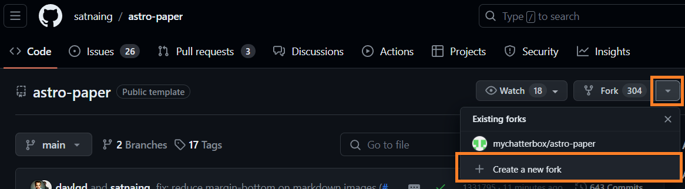

### 나도 흔한 블로그 말고 다른 블로그 좀... 뭐 그런 생각?

여기까지 어찌어찌 찾아오셨다는 것은 여러분이 [astro-paper](https://astro-paper.pages.dev/) 블로그에 관심이 있다는 것이겠지요. 

우리같이 아무 것도 모르는 초보자는 그저 남들 글을 그대로 따라해서라도 내 블로그로 만들어보고 싶은데, 도통 무슨 말인지 모르겠고, 생략을 너무 많이 해서 `똑같이 따라할 수도 없고!` `똑같이 따라해도 안되고!` `push`, `pull`, `git`, `리포지토리` 등등 몰라 어쿠 무셔!

정말정말 컴맹이거나, abcd 모르는 분들을 제외하면 충분히 따라할 수 있습니다.  
"이 블로그 애드센스 달 수 있나요?" "댓글 기능이 없네요?"  
나중에 생각합시다. 일단 시작하는 것이 중요합니다.

### Table of contents

### 시작하기 전에 준비

네이버 블로그, 티스토리, 워드프레스 등 유명한 블로그가 아닌 자체 블로그를 운영하려면 사이트를 2군데 가입해야 하고, 프로그램은 2가지 설치해야 합니다.  
가입하는 사이트들은 아주 유명한 사이트이므로 구글 계정으로 편하게 가입하세요.

- https://github.com/ 가입, 로그인 (내 블로그 파일들을 저장할 사이트)
- https://www.netlify.com/ 가입, 로그인 (내 블로그가 표시될 인터넷 주소 제공)
- [VS Code](https://code.visualstudio.com) Windows x64 버전 다운, 설치합니다. (블로그 편집, 수정)
- [GitHub Desktop](https://desktop.github.com) 설치 (편집, 수정한 블로그를 업로드하는 프로그램)

`GitHub 같은 외국 사이트 접속만해도 온통 영어뿐이라 현기증나고 무서워서 못하겠다` 하시면 곤란하고요.  
위 사이트 회원가입과 프로그램 설치하기도 버거운 분들은 시간을 내서 구글 검색으로 해결하고 오시고...  
일단 위 4가지를 마무리 해야 지금 astro-paper 혹은 나중에라도 남들의 블로그를 베껴다가 쓸 수 있습니다.

### astro-paper를 인터넷의 내 저장공간으로 복사하기

시작입니다.  
GitHub에 제작자가 등록, 공개한 astro-paper 를 내 저장공간으로 복사해보겠습니다.  
여러분의 ID는 `chobo` 라고 가정하겠습니다.

> https://github.com/satnaing/astro-paper 제작자의 페이지에 접속합니다.  
> 우측 상단 Fork 클릭한 후 + Create a new fork 를 선택합니다. (fork = copy 라고 생각하면 되겠습니다)
> 
>
> 동일하게 astro-paper 입력합니다. (저는 이미 만든 상태라 오류 메세지입니다만)
> 
> Create fork 클릭하면 잠시 후 화면이 제작자의 `satnaing / astro-paper` 가 아닌 나의 `chobo / astro-paper` 로 바뀝니다.  
> 이제 이 astro-paper 는 내꺼가 되었습니다. 요래요래 조물딱하려면 내 것으로 해야겠지요.  
>`https://github.com/chobo/astro-paper` 즐겨찾기 등록합니다. (`chobo` 대신 여러분의 ID)

### astro-paper를 내 사이트에서 확인해보기

이거 따라하면 진짜 되기는 되나? 싶은 분들을 위해 지금 바로 나의 `chobo` 사이트 주소를 만들고, astro-paper 블로그를 그대로 올려서 확인 해보겠습니다.

> 준비단계에서 가입했던 https://www.netlify.com/ 접속, 로그인합니다.  
> 왼쪽 Sites 메뉴 클릭 후 우측 `Add new site` 클릭, `Import an existing project` 클릭  
>  
> 우리가 가입했던 GitHub 가 보입니다. `Deploy with GitHub` 클릭  
>  
> `astro-paper` 클릭합니다.
>   
> 다음 단계인 Let's deploy your project 화면에서는 수정할 것이 없고, 제일 밑의 `Deploy astro-paper` 클릭합니다.
> 잠시 후 아래와 비슷한 결과가 나옵니다.
>    
>
> 이제 확인해봅시다.   
>
> 위쪽의 https://glittery-fox-1933d4.netlify.app 가 여러분의 사이트 주소입니다.  
>자신의 화면에서 클릭해보면 본인의 astro-paper 블로그를 확인할 수 있습니다.   
>`glittery-fox-1933d4` 부분을 수정합시다.  
>netlify 홈 - 왼쪽 메뉴에서 Sites 클릭 - 생성한 사이트 클릭 - Site configuration - Site details - Change site name 클릭 - 원하는 사이트이름 입력  
>내 사이트를 즐겨찾기 등록합니다.  

### 앞으로 해야할 것 들  
이후엔 이보다 더 간단합니다.  
여러분의 `https://github.com/chobo/astro-paper` 저장공간에 어떤 파일(블로그 글)을 업로드 하기만 하면 `netlify` 사이트가 지금처럼 수동이 아닌, 앞으로는 자동으로 작업을 해서 우리 블로그를 업데이트 해줍니다.  

하지만, 지금은 온전히 내 것이 아닌 기분이 드니까 이사하기 전 인테리어 하듯이 여기저기를 수정해야 합니다.  
이건 정말 초보 입장에서 노가다일 수밖에 없습니다. 