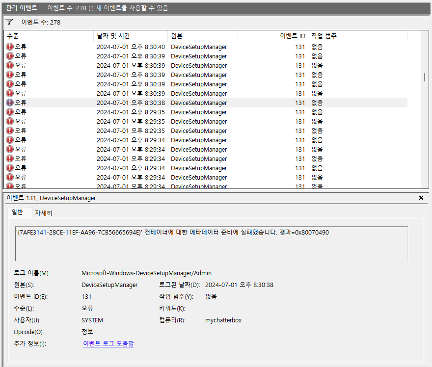
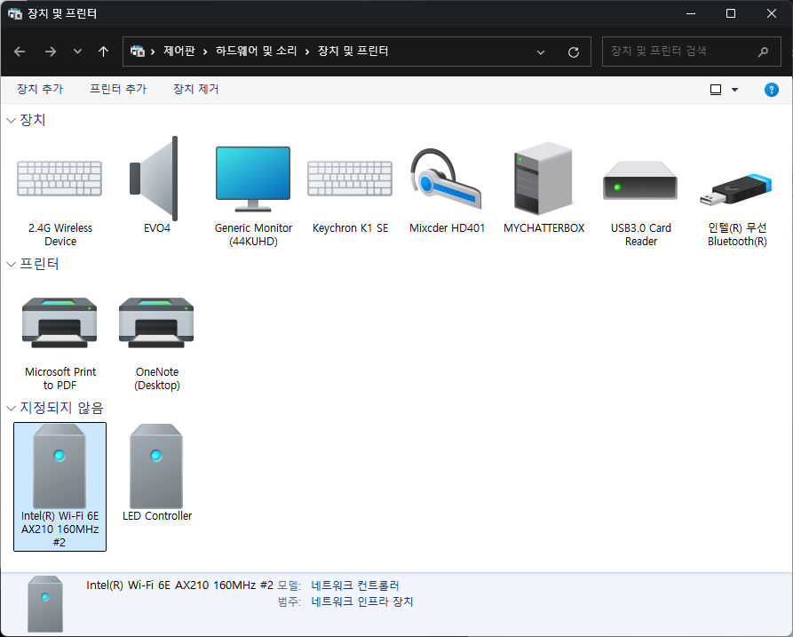
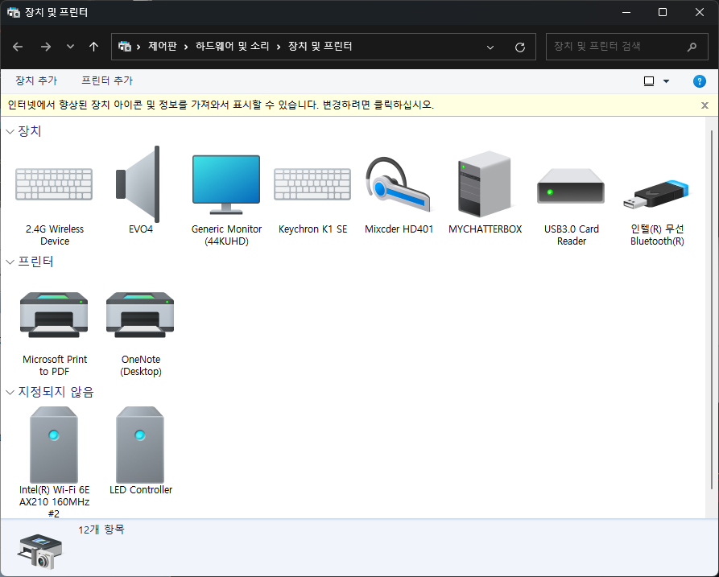
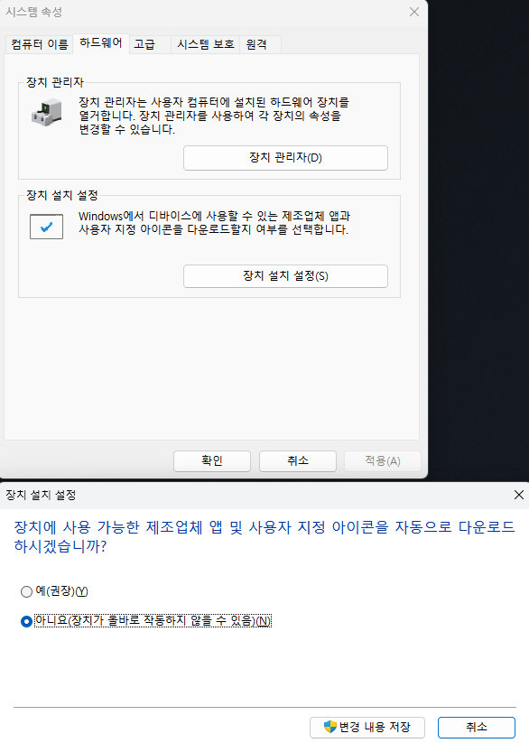

평소 이벤트뷰어를 자주 볼 필요는 없지만, 가끔 보게 되는 경우가 있는데 이와 같은 오류가 계속 쌓이는 경우가 있습니다.  

>'{51889F4F-56F0-567B-B13B-CBA74AB96373}' `컨테이너에 대한 메타데이터 준비에 실패했습니다.` 결과=0x80070490  

대부분의 오류처럼 이 오류도 성능에 전혀 지장을 주지 않는 오류 중의 하나이지만,  
너무 많이 등장하기 때문에 100% 완벽한 해결은 불가능하더라도 이벤트뷰어에 나타나지 않도록 설정할 수 있습니다.

제가 생각할 때 이 오류를 근본적으로 해결할 수 없는 이유는, 컴퓨터 주변장치의 종류가 너무 많고 그런 주변장치를 만드는 제조사들이 '메타데이터'를 제대로 만들지 않기 때문인 것 같습니다.  

제 장치 및 프린터를 보겠습니다.  
윈도우 11일 경우 Bluetooth 및 장치 > 장치 > 관련 설정 > 더 많은 장치 및 프린터 설정



둘의 차이점은 상단에 `'인터넷에서 향상된 장치 아이콘 및 정보를 가져와서 표시할 수 있습니다. 변경하려면 클릭하십시오'` 문구가 나오느냐 나오지 않느냐 입니다.  
바로 여기서 언급된 '장치 아이콘 및 정보'가 메타데이터입니다.  

이벤트뷰어 오류를 다시 봅시다.  
`"컨테이너에 대한 메타데이터 준비에 실패했습니다."`

주변기기 부품 제조사들이 메타데이터를 꼼꼼하게 만들거나, 해당 데이터가 마이크로소프트 서버에 저장되어 있어야 하는데, 정보가 불완전하기 때문에 오류가 생기는 것으로 추정합니다.

해결합시다.  
윈도우 시작버튼 우클릭 > 시스템 > 장치 사양 > 고급 시스템 설정 > 하드웨어 탭 > 장치 설치 설정  
아래처럼 자동으로 다운로드 하지 않도록 만들면 이제부터 이 이벤트 오류는 기록되지 않습니다.  
장치들의 메타데이터를 MS 서버에서 받아오지 않기 때문입니다.  




>`이벤트뷰어 로그를 전부 지우고 초기화`하려면  
명령 프롬프트(CMD)를 관리자 권한으로 열고 아래 명령어를 실행하세요.  

```
for /F "tokens=*" %1 in ('wevtutil.exe el') DO wevtutil.exe cl "%1"
```
