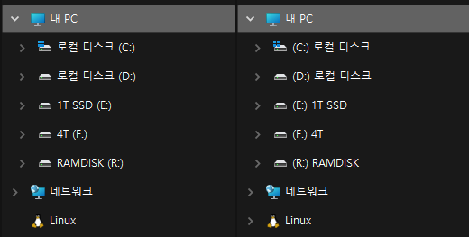

오른쪽처럼 드라이브명을 앞으로 오게 만듭니다.  
레지스트리 편집기에 내용을 추가하고, 탐색기 프로세스 종료한 뒤 탐색기를 재실행하는 과정까지 한 번에 처리합니다.  
`탐색기-드라이브명-앞으로.bat` 처럼 알기 쉬운 이름으로 빈파일을 하나 만들고 아래 내용으로 저장합니다.  

```
@echo off
REG ADD "HKCU\SOFTWARE\Microsoft\Windows\CurrentVersion\Explorer" /V ShowDriveLettersFirst /T REG_DWORD /D 4 /F
taskkill /f /im explorer.exe
start explorer.exe
```

만약 원래대로 되돌리고 싶다면, /D 4 /F 부분의 4를 1로 변경한 뒤 실행합니다.